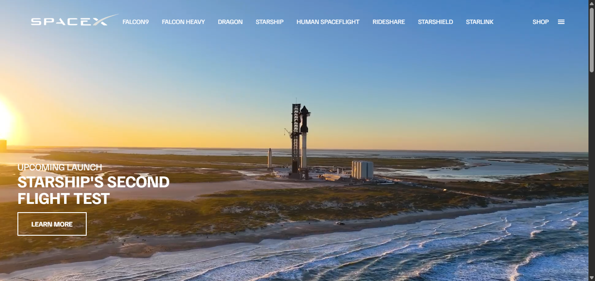

## 🚀 SpaceX Website Clone

A responsive and animated clone of the SpaceX website built using HTML, CSS, and JavaScript. This project showcases beautiful animations, smooth transitions, and modern UI design, inspired by the official SpaceX site.

### 🔗 Live Demo

Vercel: [Live Site](https://space-x-website-alpha.vercel.app/)

## 🖼️ Preview



📌 Features
- Responsive layout for desktop and mobile

- Animated text and smooth scrolling

- Modern layout with engaging visuals

- Clean and well-structured code

## 🛠️ Technologies Used

- HTML5
- CSS3
- JavaScript 
- Deployed on Vercel

## 📁 Folder Structure

```
 SpaceX-Website/
├── index.html
├── style.css
├── script.js
├── assets/
│   └── images, videos, icons
```

## 🧠 Lessons Learned

This project helped me:
- Practice modern HTML/CSS layout techniques
- Understand responsive web design
- Improve attention to design details and alignment
- Work with deployment tools like Vercel


## 📌 Note

This is a personal project created for educational purposes only. All trademarks and content are owned by Apple Inc.

## 🧑‍💻 Author

- **Hailemichael Negusse**
- 
## Installation and Setup

  1. **Clone the repository**
  ```sh
 git clone https://github.com/hilla10/SpaceX-Website.git
  cd your-repo
  ```


